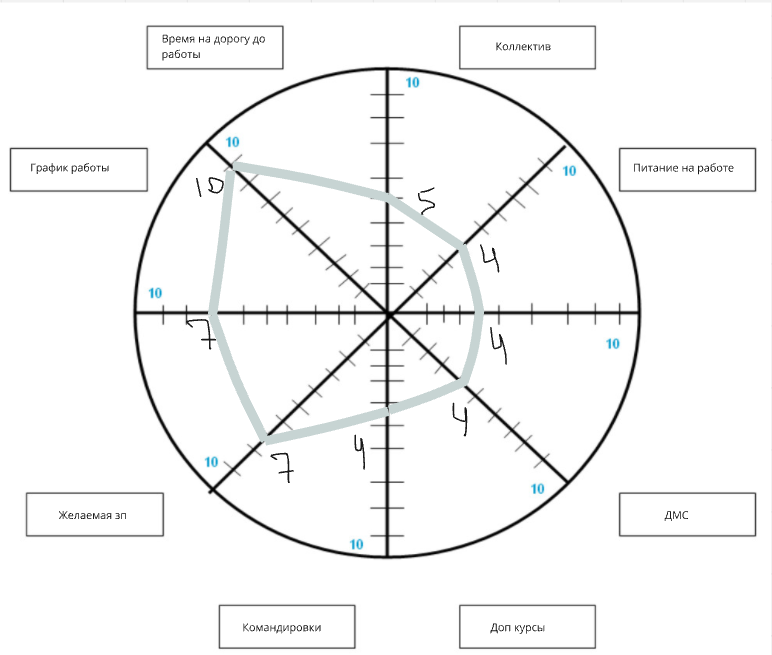
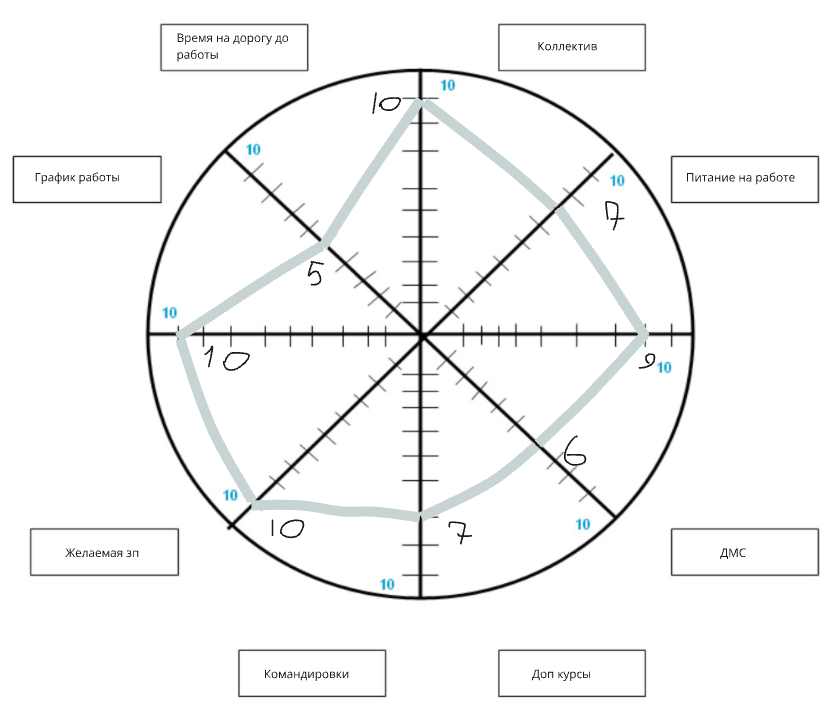
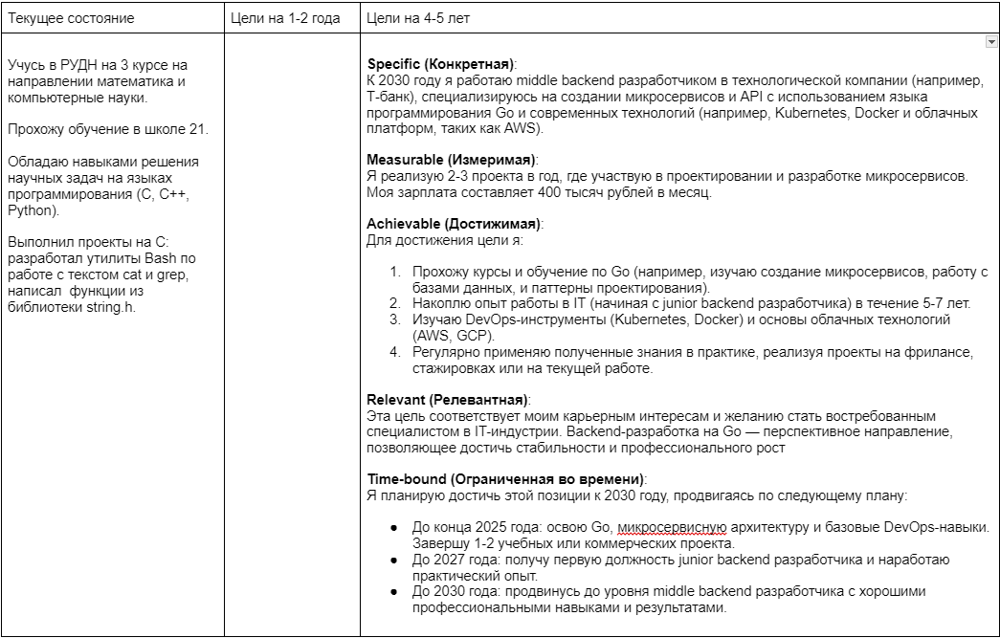

# Отчет по выполнению 1 проекта в карьерном треке

## Exercise 00 
### Колесо карьерного баланса
1. Приоритеты на данный момент

 

2. Приоритеты через 5 лет

 

3. Для достижения критериев на второй диаграмме я буду стремиться выполнять следующие действия: 
- График работы.  
Согласую оптимальный график с руководством и обсужу возможность гибкого графика (например, сдвиг времени начала и окончания работы).

- Время на дорогу до работы. 
Рассмотрю варианты работы удаленно или ближе к дому. Узнаю о возможности гибридного или удаленного графика.

- Коллектив. Буду участвовать в командных активностях, присоединюсь к корпоративным мероприятия. Постараюсь наладить дружелюбное общение с коллегами, может, вместе будем ходить в зал или развлекаться в свободное время.

- Питание на работе. Буду искать работу, где есть коррпоративное питание. Хочется, чтобы была своя столовая или скидки на еду.

- ДМС. Сравню страховые предложения. Узнаю, какие компании предоставляют наиболее выгодные условия, если ДМС отсутствует.

- Дополнительные курсы. В целях повышения квалификации, попрошу оплачивать курсы, которые помогут в карьере или личном развитии.

- Командировки. Уточню у работодателя, какие командировки планируются (график, длительность, компенсация).

- Желаемая зарплата. Пройду курсы и тренинги для повышения навыков, которые сделают меня более ценным специалистом. Составлю план карьерного роста: обсужу с руководством, какие шаги помогут получить повышение.

## Exercise 01
### Карьерные цели

 