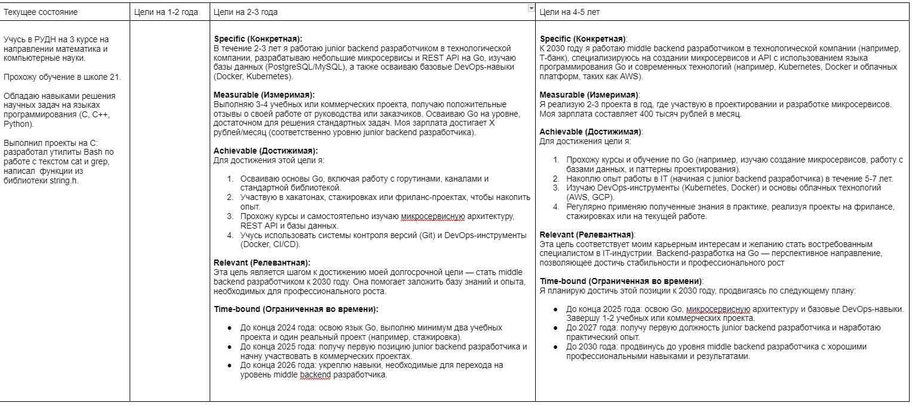
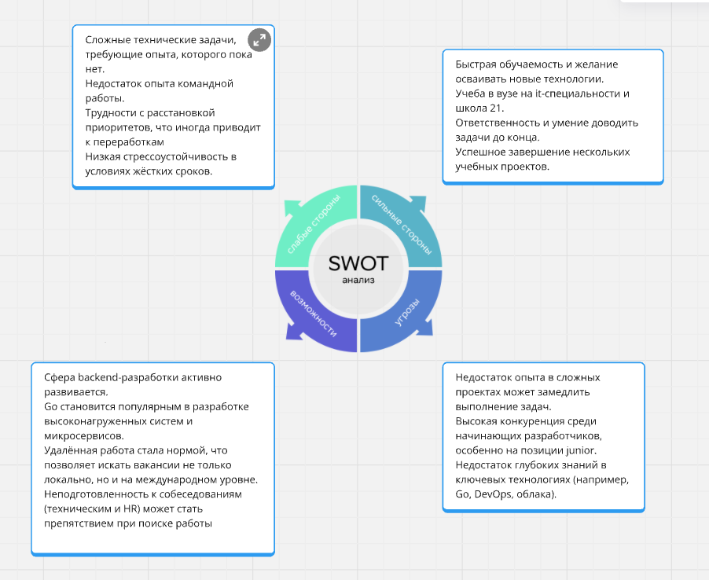

# Отчет по выполнению 2 проекта в карьерном треке

## Exercise 00 
### Выбор компании

**Чек-лист выбора компании**

1. Зарплата (ЗП):
   - Уровень оплаты труда соответствует моим ожиданиям и рыночным стандартам.
   - Прозрачная система повышения зарплаты и бонусов.

2. Рабочий график:
   - Гибкий график работы.
   - Возможность удаленной работы и брать дни удаленно при необходимости.

3. Коллектив:
   - Дружелюбная атмосфера и поддерживающие коллеги.
   - Эффективная коммуникация внутри команды.

4. Интерес к работе:
   - Должность соответствует моим профессиональным интересам и увлечениям.
   - Возможность работать над задачами, которые вызывают вдохновение.

5. Дорога до работы:
   - Расположение офиса в пределах 30-45 минут езды от дома.
   - Есть оплата каршеринга.

6. Соотношение работы и личной жизни:
   - Время, уделяемое работе, не мешает личной жизни.
   - Отсутствие переработок.

7. "Плюшки", которые дает компания:
   - Дополнительные бонусы: тренинги, медицинская страховка, спортзал, питание и т.д.
   - Современное оборудование и комфортные условия труда.

8. Возможности для роста:
   - Наличие четкой траектории профессионального развития.
   - Поддержка обучения и повышения квалификации.

9. Ценности компании:
   - Совпадают ли ценности компании с личными?
   - Социальная ответственность и экологичность компании.

10. Стабильность и перспективы:
	- Надежность компании на рынке.
	- Возможности для долгосрочной карьеры.

**Компании в которых хотелось бы порабоать.**

1. T-банк
- **Зарплата:** Высокая с бонусной системой.
- **Гибкость:** Удалённая работа, гибкий график.
- **Коллектив:** Молодая и профессиональная команда.
- **Плюшки:** Обучение, скидки на банковские продукты, медстраховка.
- **Интерес:** Финансовые и IT-продукты, автоматизация процессов.

2. Яндекс
- **Зарплата:** Конкурентоспособная, прозрачная система бонусов.
- **Гибкость:** Удалёнка, гибкий график.
- **Коллектив:** Инновационная и профессиональная команда.
- **Плюшки:** Обучение, корпоративы, компенсация спорта, медстраховка.
- **Интерес:** Разработка высокотехнологичных продуктов (такси, поиск, доставка и др.).

3. ВКонтакте
- **Зарплата:** Конкурентоспособная зарплата и бонусы.
- **Гибкость:** Гибкий график и удалённая работа.
- **Коллектив:** Молодой и творческий коллектив.
- **Плюшки:** Медстраховка, обучение, мероприятия.
- **Интерес:** Проекты в сфере социальных сетей и развлекательных технологий.

4. Сбербанк
- **Зарплата:** Высокая с прозрачной системой премий.
- **Гибкость:** Гибкий график, возможность работать удалённо.
- **Коллектив:** Поддерживающая команда, возможность карьерного роста.
- **Плюшки:** Обучение, ДМС, льготы для сотрудников, корпоративы.
- **Интерес:** Работа с масштабными финансовыми и IT-проектами.

5. Ozon
- **Зарплата:** Конкурентоспособная с бонусами за результативность.
- **Гибкость:** Возможность гибридного формата работы.
- **Коллектив:** Энергичная команда.
- **Плюшки:** Скидки на товары, корпоративное обучение.
- **Интерес:** Электронная коммерция и логистика.

**Вакансии компаний**

1. Т-банк: 
- https://hh.ru/vacancy/97625652?hhtmFrom=vacancy_search_list
- https://hh.ru/vacancy/108967633?hhtmFrom=vacancy_search_list

2. Яндекс:
- https://hh.ru/vacancy/111748895?query=яндекс&hhtmFrom=vacancy_search_list
- https://hh.ru/vacancy/114992356?query=яндекс&hhtmFrom=vacancy_search_list
- https://hh.ru/vacancy/103780873?query=яндекс&hhtmFrom=vacancy_search_list

3. Вконтакте:
- https://hh.ru/vacancy/112325580?query=вконтакте&hhtmFrom=vacancy_search_list
- https://hh.ru/vacancy/111801876?query=вконтакте&hhtmFrom=vacancy_search_list

4. Сбербанк:
- https://hh.ru/vacancy/114809642?query=сбербанк&hhtmFrom=vacancy_search_list
- https://hh.ru/vacancy/111893634?hhtmFrom=vacancy_search_list

5. Озон:
- https://hh.ru/vacancy/111519707?hhtmFrom=vacancy_search_list
- https://hh.ru/vacancy/110645391?hhtmFrom=vacancy_search_list

## Exercise 01
### Анализ вакансий

1. Провел все анализы в таблице анализ_вакансий.xlsx

2. На основании аналитики требований и обязанностей прописал шаги по достижению целей через 2-3 года.

> цель на 2-3 года

## Exercise 02
### Анализ навыков

> swot анализ
