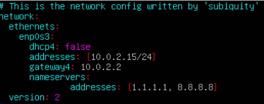
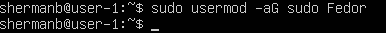
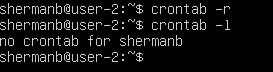

# Отчет по выполнению 1 проекта в ветке Devops

## Part 1. Установка ОС
1. Скачал установочный образ Ubuntu 20.04 без графического интерфейса с сайта
https://old-releases.ubuntu.com/releases/20.04/

2. Установил VirtualBox с сайта 
https://www.oracle.com/cis/virtualization/technologies/vm/downloads/virtualbox-downloads.html 

3. В VirtualBox создал новую виртуальную машину.

4. Задал имя виртуальной машины, образ ICO, имя пользователя, пароль, оперативную память и процессоры.

5. Запустил машину и выполнил базовую настройку.

6. Узнал версию Ubuntu, выполнив команду
<pre><code>cat /etc/issue</code></pre>

>версия системы

## Part 2. Создание пользователя
1. Создал нового пользователя в группе adm
<pre><code>sudo useradd -G adm Fedor</code></pre>

>добавление нового пользователя

2. Проверил наличие нового пользователя
<pre><code>cat /etc/passwd</code></pre>

>проверка 

## Part 3. Настройка сети ОС
1. Задал название машины user-1
<pre><code>sudo hostnamectl set-hostname user-1</code></pre>

>host - user-1

2. Выполнил перезагрузку и проверил изменения
<pre><code>hostnamectl status</code></pre>

> проверка статуса

3. Установил часовой пояс, в котором я нахожусь
<pre><code>sudo timedatectl set-timezone Europe/Moscow
</code></pre>

> установка часового пояса

4. Вывел названия сетевых интерфейсов
<pre><code>ip link show</code></pre>

>сетевые интерфейсы

Наличие lo интерфейса обеспечивает возможность локальной коммуникации на компьютере, что необходимо для нормальной работы многих программ и сервисов

5. Получил ip адрес устройства от DHCP-сервера
<pre><code>ip -a</code></pre>

>ip адрес от DHCP-сервера

DHCP (англ. Dynamic Host Configuration Protocol — протокол динамической настройки узла) — сетевой протокол, позволяющий сетевым устройствам автоматически получать IP-адрес и другие параметры, необходимые для работы в сети TCP/IP.

6. Определил и вывел на экран внешний и внутренний ip-адрес шлюза 
<pre><code>curl ifconfig.me</code></pre>

>внешний ip-адрес шлюза

<pre><code>ip route</code></pre>

>внутренний ip-адрес шлюза

7. Задал статичные (заданные вручную, а не полученные от DHCP-сервера) настройки ip, gw, dns (используй публичный DNS-серверы, например 1.1.1.1 или 8.8.8.8)
<pre><code>sudo vim /etc/netplan/00-installer-config.yaml</code></pre>

>статичные настройки ip, gw, dns

8. Перезагрузил и пропинговал удаленные хосты 1.1.1.1 и ya.ru.
<pre><code>ping 1.1.1.1</code></pre>

>успешная работа хоста 1.1.1.1

<pre><code>ping ya.ru</code></pre>

>успешная работа хоста ya.ru

## Part 4. Обновление ОС

1. Обновил системные пакеты до последней на момент выполнения задания версии.
<pre><code>sudo apt upgrade && sudo apt update</code></pre>

>обновленная система

## Part 5. Использование команды **sudo**

1. Дал пользователю Fedor права на команду sudo
<pre><code>sudo usermod -aG sudo Fedor</code></pre>

>права sudo у другого пользователя

Команда sudo предоставляет возможность пользователям выполнять команды от имени суперпользователя root, либо других пользователей.

2. Обновил пакеты системы, сделал reboot и зашел через второго пользователя.

3. Задал новый hostname user-2
<pre><code>sudo hostnamectl set-hostname user-2</code></pre>

4. Обновил файл /etc/hosts

>etc/hosts

5. Проверка изменений
<pre><code>hostnamectl</code></pre>

>все ок

## Part 6. Установка и настройка службы времени

1. Установил библиотеку chronyd для автоматической синхронизации времени
<pre><code>sudo apt update
sudo apt install chrony</code></pre>

2. Убедился, что NTP синхронизация включена и активна, выполнил команду.
<pre><code>timedatectl show</code></pre>

> текущее время

## Part 7. Установка и использование текстовых редакторов 

1. Установил vim, nano и mcedit.
<pre><code>sudo apt install vim nano mcedit</code></pre>

2. Создал текстовый файл test_vim.txt и открыл его для записи
<pre><code>vim test_vim.txt</code></pre>

> test_vim.txt

Для сохрания и выхода ввел комбинацию :wq

3. Создал текстовый файл test_nano.txt и открыл его для записи
<pre><code>nano test_nano.txt</code></pre>

> test_nano.txt

Для сохранения нажал Ctrl+O, затем Enter для подтверждения имени файла. И Ctrl+X для выхода.

4. Создал текстовый файл test_mcedit.txt и открыл его для записи
<pre><code>mcedit test_mcedit.txt</code></pre>

> test_mcedit.txt

Для сохранения нажал F2, затем F10 для выхода.

5. Открыл файл test_vim.txt для записи строки 21 School 21
<pre><code>vim test_vim.txt</code></pre>

> test_vim.txt

Для выхода без сохранения нажал Esc, затем ввел :q!

6. Открыл файл test_nano.txt для записи строки 21 School 21
<pre><code>nano test_nano.txt</code></pre>

> test_nano.txt

Для выхода без сохранения нажал Ctr+X, затем ввел N

7. Открыл файл test_mcedit.txt для записи строки 21 School 21
<pre><code>mcedit test_mcedit.txt</code></pre>

> test_nano.txt

Для выхода без сохранения нажал F10 и No.

8. Открыл файл test_vim.txt, сделал новую запись и в поиске нашел никнейм
<pre><code>vim test_vim.txt</code></pre>

> test_vim.txt

Для поиска слова нажал Esc и ввел следующее /shermanb и Enter.

Для замены слова ввел команду
<pre><code>:%s/shermanb/Fedor/g</code></pre>

> test_vim.txt

Для сохранения и выхода ввел
<pre><code>:wq</code></pre>

> test_vim.txt

9. Открыл файл test_nano.txt, сделал новую запись и в поиске нашел никнейм
<pre><code>nano test_nano.txt</code></pre>

> test_nano.txt

Для поиска слова нажал Ctr+W и ввел следующее /shermanb и Enter.

Для замены слова нажал Ctr + \ 
Search: shermanb, Replace: Fedor. 

> test_nano.txt

> test_nano.txt

Нажал A для изменения. Сохранил и вышел комбинациями Ctr + O, Ctr + X

10. Открыл файл test_mcedit.txt, сделал новую запись и в поиске нашел никнейм
<pre><code>mcedit test_mcedit.txt</code></pre>

> test_mcedit.txt

Для поиска нажал F7, ввел shermanb и Enter.

Для замены слова нажал F4, Serach: shermanb, Replace: Fedor.

> test_mcedit.txt

> test_mcedit.txt

Сохранил и вышел F2 и F10

## Part 8. Установка и базовая настройка сервиса **SSHD**

1. Установил SSH-сервер и убедился в работоспособности
<pre><code>sudo apt install openssh-server
sudo systemctl status ssh</code></pre>

> status ssh

2. Включил SSH-сервер на автозагрузку с помощью команды
<pre><code>sudo systemctl enable ssh</code></pre>
Проверил, что SSH автоматически запускается при загрузке
<pre><code>sudo systemctl is-enabled ssh</code></pre>

> автозагрузка ssh

3. Для перенастройки SSHd на порт 2022 открыл конфигурационный файл SSH и в строке #Port 22 заменил 22 на 2022 и убрал #
<pre><code>sudo nano /etc/ssh/sshd_config</code></pre>

> Port 2022

4. Проверил состояние процесса командой ps
<pre><code>ps -aux | grep sshd</code></pre>

> запущенные процессы

- ps отображает список процессов в системе.
- -a показывает процессы всех пользователей.
- -u выводит информацию о пользователе, запустившем процесс.
- -x включает процессы, не привязанные к терминалу.
- grep sshd фильтрует вывод, оставляя только строки, содержащие sshd.

5. Проверил процесс sshd командой netstat 
<pre><code>sudo netstat -tan | grep 2022</code></pre>

> запущенные процессы

Команда netstat служит для вывода сетевой статистики, включая информацию о сетевых соединениях и портах.

Объяснение опций:
- -t — показывает соединения TCP.
- -a — отображает все активные соединения и порты.
- -n — выводит адреса и порты в числовом формате (без разрешения DNS).

Объяснение столбцов:
- tcp: Протокол TCP.
- 0 0 0.0.0.0:2022: Локальный адрес 0.0.0.0 и порт 2022, что означает, что служба слушает на всех доступных IP-адресах на порту 2022.
- 0.0.0.0:*: Внешний адрес 0.0.0.0 и звёздочка вместо порта, что означает, что служба слушает на всех доступных IP-адресах на любом порту.
- LISTEN: Состояние прослушивания, что означает, что служба активно слушает на этом порту и готова принимать соединения.

0.0.0.0 означает, что служба слушает все сетевые интерфейсы на указанном порту.

## Part 9. Установка и использование утилит **top**, **htop**

1. Ввел команду top
<pre><code>top</code></pre>

> top

- uptime - 40 минут
- количество авторизованных пользователей - 1
- среднюю загрузку системы - 0.05, 0.03, 0.00
- общее количество процессов - 93 total, 1 running, 92 sleeping, 0 stopped, 0 zombie
- загрузка cpu - 0.0 us, 0.7 sy, 0.0 ni, 99.3 id, 0.0 wa, 0.0 hi, 0.0 si, 0.0 st
- загрузка памяти Mib Mem - 1971.6 total, 1451.3 free, 139.4 used, 380.9 buff/cache
- pid процесса занимающего больше всего памяти - PID 1 
- pid процесса, занимающего больше всего процессорного времени - PID 1257

2. Ввел команду htop 
<pre><code>htop</code></pre>

> htop

Для сортировки по столбцам нажимал F6 и вводил искомое значение

> отсортированный вывод по PID

> отсортированный вывод по PERCENT_CPU

> отсортированный вывод по PERCENT_MEM

> отсортированный вывод по TIME

Отфильтровал вывод для процесса sshd через F4

> отсортированный вывод по sshd

Отфильтровал вывод для процесса syslog через F3

> отсортированный вывод по syslog

Добавил вывод hostname, clock и uptime через F2

> добавление фильтров

## Part 10. Использование утилиты **fdisk**

1. Запустил команду fdisk -l
<pre><code>sudo fdisk -l</code></pre>

> fdisk -l

- название жесткого диска - sda
- размер - 25 gib
- количество секторов - 52428800 sectors

2. Вывел информацию о swap следующими командами
<pre><code>swapon --show
free -h
lsblk</code></pre>

> swap info

## Part 11. Использование утилиты **df** 

1. Выполнил команду для получения информации о дисковом пространстве
<pre><code>df /</code></pre>

> вывод команды df /

- размер раздела - 25623780
- размер занятого пространства - 5379964
- размер свободного пространства - 18916868
- процент использования - 23%
- единица измерения - 1K-blocks  

2. Выполнил команду для получения информации о дисковом пространстве с типом файловой системы и размерами
<pre><code>df -Th /</code></pre>

> вывод команды df -Th /

- размер раздела - 25 G
- размер занятого пространства - 5.2 G
- размер свободного пространства - 19 G
- процент использования - 23%
- тип файловой системы для раздела - ext4.

## Part 12. Использование утилиты **du**

1. Запустил команду du
<pre><code>du /</code></pre>

> вывод команды du

2. Вывел размер папок /home, /var, /var/log в байтах
<pre><code>sudo du -sb /var/log /home /var
</code></pre>

> размер папок в байтах

3. Вывел размер всего содержимого в /var/log
<pre><code>sudo du -h /var/log/*</code></pre>

> содержимое в /var/log

## Part 13. Установка и использование утилиты **ncdu**

1. Установил утилиту ncdu
<pre><code>sudo apt install ncdu</code></pre>

2. Вывел размер папок /home, /var, /var/log через ncdu
<pre><code>ncdu /home</code></pre>

> содержимое в /home

<pre><code>ncdu /var</code></pre>

> содержимое в /var

<pre><code>ncdu /var/log</code></pre>

> содержимое в /var/log

## Part 14. Работа с системными журналами

1. Открыл для просмотра каталог /var/log/dmesg
<pre><code>sudo less /var/log/dmesg</code></pre>

> содержимое в /var/log/dmesg

2. Открыл для просмотра каталог /var/log/syslog
<pre><code>sudo less /var/log/syslog</code></pre>

> содержимое в /var/log/syslog

3. Открыл для просмотра каталог /var/log/auth.log
<pre><code>sudo less /var/log/auth.log</code></pre>

> содержимое в /var/log/auth.log

4. В файле /var/log/auth.log через команду less пролистал до конца и нашел запись с временем последней авторизации, имя пользователя и метод входа в систему
<pre><code>sudo less /var/log/auth.log</code></pre>

> содержимое в последней записи в /var/log/auth.log

5. Перезапустил службу sshd командой
<pre><code>sudo systemctl restart sshd</code></pre>

> restart sshd

## Part 15. Использование планировщика заданий **CRON**

1. Зашел в редактор планировщика CRON и вписал запуск uptime через каждые 2 минуты
<pre><code>crontab -e</code></pre>

> запуск CRON через nano

2. Нашел в системных журналах строчки (минимум две в заданном временном диапазоне) о выполнении
<pre><code>cat /var/log/syslog | grep CRON</code></pre>

> вывод системного журнала с CRON

3. Вывел на экран список текущих заданий для CRON
<pre><code>crontab -l</code></pre>

> вывод текущих заданий для CRON

4. Удалил все задания для планировщика заданий
<pre><code>crontab -r</code></pre>

> вывод текущих заданий для CRON