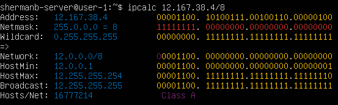
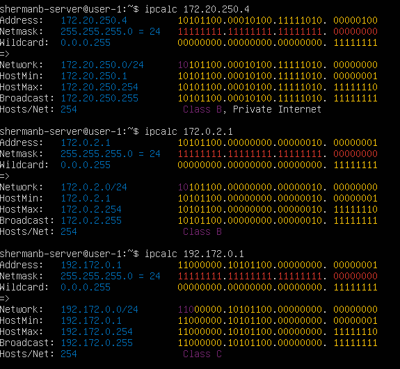
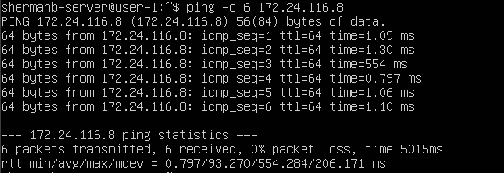
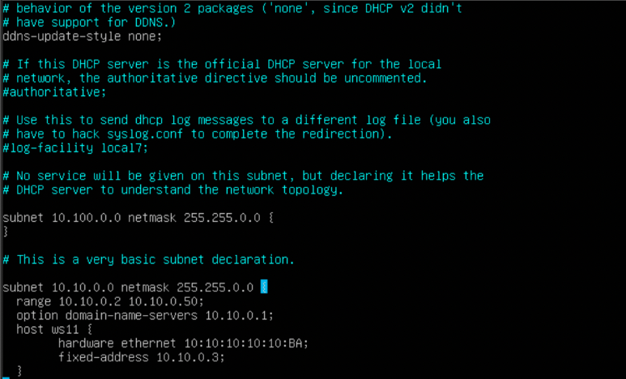
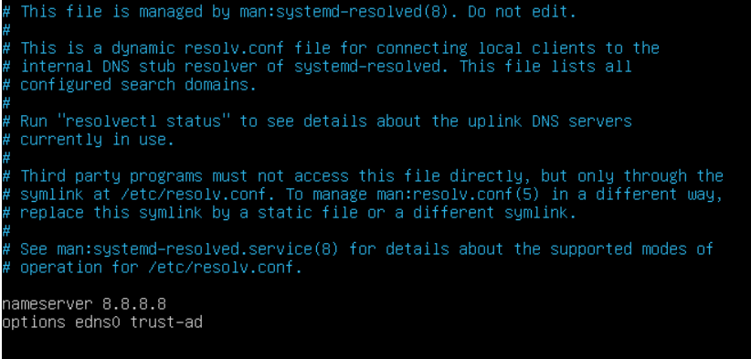
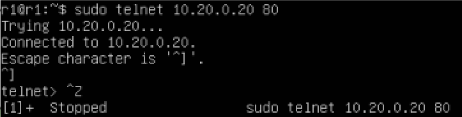

# Отчет по выполнению 2 проекта в ветке Devops

## Part 1. Инструмент **ipcalc**

1. Определил адрес сети *192.167.38.54/13*

<pre><code>ipcalc 192.167.38.54/13</code></pre>

>адрес сети

2. Перевел маски *255.255.255.0* в префиксную и двоичную запись, */15* в обычную и двоичную, *11111111.11111111.11111111.11110000* в обычную и префиксную

<pre><code>ipcalc 255.255.255.0</code></pre>

>префиксная и двоичная записи

<pre><code>ipcalc /15</code></pre>

>обычная и двоичная записи

<pre><code>ipcalc 255.255.255.240</code></pre>

>обычная и префиксная записи

3. Определил минимальный и максимальный хост в сети *12.167.38.4* при масках: */8*, *11111111.11111111.00000000.00000000*, *255.255.254.0* и */4*

<pre><code>ipcalc 12.167.38.4/8</code></pre>

>минимальный и максимальный хост при маске /8

<pre><code>ipcalc 12.167.38.4/255.255.0.0</code></pre>

>минимальный и максимальный хост при маске 11111111.11111111.00000000.00000000

<pre><code>ipcalc 12.167.38.4/255.255.254.0</code></pre>

>минимальный и максимальный хост при маске 255.255.254.0

<pre><code>ipcalc 12.167.38.4/4</code></pre>

>минимальный и максимальный хост при маске /4

4. Определил, можно ли обратиться к приложению, работающему на localhost, со следующими IP: *194.34.23.100*, *127.0.0.2*, *127.1.0.1*, *128.0.0.1*

- localhost — это особый адрес, который обычно ассоциируется с IP-адресом 127.0.0.1. Любой адрес из диапазона 127.0.0.0/8 (т.е., все адреса от 127.0.0.0 до 127.255.255.255) — это loopback-адреса. Эти адреса предназначены только для обращения к самому себе.

<pre><code>ping -c 4 194.34.23.100</code></pre>

>ip 194.34.23.100 недоступен с локального сервера

- При успешном соединении выведутся 4 строчки с ответами.

<pre><code>ping -c 4 127.0.0.2</code></pre>

>ip 127.0.0.2 доступен с локального сервера

<pre><code>ping -c 4 127.1.0.1</code></pre>

>ip 127.1.0.1 доступен с локального сервера

<pre><code>ping -c 4 128.0.0.1</code></pre>

>ip 128.0.0.1 недоступен с локального сервера

5. Определил, какие из перечисленных IP можно использовать в качестве публичного, а какие только в качестве частных: *10.0.0.45*, *134.43.0.2*, *192.168.4.2*, *172.20.250.4*, *172.0.2.1*, *192.172.0.1*, *172.68.0.2*, *172.16.255.255*, *10.10.10.10*, *192.169.168.1*

- Частные IP-адреса предназначены для использования внутри локальных сетей и не маршрутизируются в глобальной сети Интернет. Частные диапазоны:
10.0.0.0 – 10.255.255.255
Маска: /8 (1-й октет равен 10).
172.16.0.0 – 172.31.255.255
Маска: /12 (1-й октет равен 172, а 2-й октет — от 16 до 31 включительно).
192.168.0.0 – 192.168.255.255
Маска: /16 (1-й октет равен 192, а 2-й — 168).

- Публичные IP-адреса — это адреса, которые могут маршрутизироваться в глобальной сети Интернет. Любой IP-адрес, который не попадает в частные диапазоны или диапазон зарезервированных адресов (например, 127.0.0.0/8 для loopback), может использоваться как публичный.

>проверка состояний

- ip 10.0.0.45 и 192.168.4.2 - частные,  134.43.0.2 - публичный

>проверка состояний

- ip 172.20.250.4 - частный,  172.0.2.1 и 192.172.0.1 - публичные

>проверка состояний

- ip 172.16.255.255 и 10.10.10.10 - частные,  172.68.0.2 - публичный

>проверка состояний

- ip 192.169.168.1 - публичный

6. Опрделил, какие из перечисленных IP-адресов шлюза возможны у сети *10.10.0.0/18*: *10.0.0.1*, *10.10.0.2*, *10.10.10.10*, *10.10.100.1*, *10.10.1.255*

>ip 10.0.0.1 не входит в сеть 10.10.0.0/18

>ip 10.10.0.2 входит в сеть 10.10.0.0/18

>ip 10.10.10.10 входит в сеть 10.10.0.0/18

>ip 10.10.100.1 не входит в сеть 10.10.0.0/18

>ip 10.10.1.255 входит в сеть 10.10.0.0/18

## Part 2. Статическая маршрутизация между двумя машинами

1. Посмотрел текущие сетевые интерфейсы на двух машинах ws1 и ws2.

<pre><code>ip a</code></pre>

>ws1

<pre><code>ip a</code></pre>

>ws2

2. Задал следующие адреса и маски: ws1 — *192.168.100.10*, маска */16*, ws2 — *172.24.116.8*, маска */12*. Выполнил перезагрузку сервиса сети.

<pre><code>sudo nano /etc/netplan/00-installer-config.yaml
sudo netplan apply</code></pre>

>config.yaml в ws1

<pre><code>sudo nano /etc/netplan/00-installer-config.yaml
sudo netplan apply</code></pre>

>config.yaml в ws2

3. Добавил статический маршрут от одной машины до другой и обратно при помощи команды вида `ip r add`. Пропинговал соединение между машинами.

<pre><code>sudo ip r add 172.24.116.8 via 192.168.100.10 dev enp0s3</code></pre>

>маршрут от ws1 до ws2

<pre><code>ping -c 6 172.24.116.8</code></pre>

>успешное соединение

<pre><code>sudo ip r add 192.168.100.10 via 172.24.116.8 dev enp0s3</code></pre>

>маршрут от ws2 до ws1

<pre><code>ping -c 6 192.168.100.10</code></pre>

>успешное соединение

4. Перезапустил машины. Добавил статический маршрут от одной машины до другой с помощью файла */etc/netplan/00-installer-config.yaml* и пропинговал соединение.

<pre><code>sudo nano /etc/netplan/00-installer-config.yaml
sudo netplan apply</code></pre>

>статический маршурт от ws1 до ws2 в config.yaml 

<pre><code>ping -c 6 172.24.116.8</code></pre>

>успешное соединение

<pre><code>sudo nano /etc/netplan/00-installer-config.yaml
sudo netplan apply</code></pre>

>статический маршурт от ws2 до ws1 в config.yaml 

<pre><code>ping -c 6 192.168.100.10</code></pre>

>успешное соединение

## Part 3. Утилита **iperf3**

1. Перевод единиц измерения:
   - 8 Mbps = 1 MB/s
   - 100 MB/s = 819200 Kbps
   - 1 Gbps = 1024 Mbps.

2. Измерил скорость соединения между ws1 и ws2.

<pre><code>iperf3 -s</code></pre>

>информация на серверной части (ws1)

<pre><code>iperf3 -с 192.168.100.10</code></pre>

>информация на клиентской части (ws2)

- В выводе сервера видно: с какого адреса подключился клиент и порт его машины, идентификатор потока(по умолчанию 5), интервал времени тестирования, объем данных,переданный за указанный период, скорость передачи, sender (данные, отправленные клиентом на сервер), receiver (данные, полученные клиентом от сервера). В выводе клиента видно: адрес сервера и порт, идентификатор потока(по умолчанию 5), интервал времени тестирования, объем данных,переданный за указанный период, скорость передачи, количество ретрансмиссий, cwnd(сколько данных может быть отправлено без подтверждения), sender (данные, отправленные клиентом на сервер), receiver (данные, полученные клиентом от сервера).

## Part 4. Сетевой экран

1. Создал файлы /etc/firewall.sh на ws1 и ws2. Добавил в файлы подряд следующие правила:
##### 1) На ws1 примени стратегию, когда в начале пишется запрещающее правило, а в конце пишется разрешающее правило (это касается пунктов 4 и 5).
##### 2) На ws2 примени стратегию, когда в начале пишется разрешающее правило, а в конце пишется запрещающее правило (это касается пунктов 4 и 5).
##### 3) Открой на машинах доступ для порта 22 (ssh) и порта 80 (http).
##### 4) Запрети *echo reply* (машина не должна «пинговаться», т. е. должна быть блокировка на OUTPUT).
##### 5) Разреши *echo reply* (машина должна «пинговаться»).

<pre><code>sudo nano /etc/firewall.sh
sudo chmod +x /etc/firewall.sh
sudo /etc/firewall.sh</code></pre>

>firewall.sh на ws1

- `iptables -F`- очищает инструкции для управления сетевым трафиком в таблице `filter`(основная таблица для фильтрации сетевого трафика, выбирается по умолчанию).
- `iptables -X`- очищает пользовательские цепочки, которые используются для комбинации правил.
- `iptables -A INPUT -p tcp --dport 22 -j ACCEPT`-  добавляет правило в конец цепочки `INPUT`,отвечающую за входящий трафик. Указывает, что это правило применяется только к `TCP-трафику`. Указывает порт `22` для `SSH`. Принимает пакет, если он соответствует правилу.
- `iptables -A INPUT -p tcp --dport 80 -j ACCEPT`- схожее правило, только для порта `80`, используется для протокола `HTTP` (HyperText Transfer Protocol). Необходимо для передачи веб-страниц и других данных между веб-сервером и браузером.
- `iptables -A OUTPUT -p icmp --icmp-type echo-reply -j DROP`- добавляет правило в конец цепочки `OUTPUT`, отвечающую за исходящий трафик. Указывает, что это правило применяется только к `ICMP-трафику`(трафик для диагностики сети). Указывает тип `ICMP-пакета`. И указывает, что пакет - `echo-reply` в ответ на `echo-request` будет отброшен без уведомления отправителя, т.е. при попытке пропинговать машину, она не ответит.
- `iptables -A OUTPUT -p icmp --icmp-type echo-reply -j ACCEPT`- схожее правило, но оно разрешает отправку пакетов в ответ на `echo-request`.

<pre><code>sudo nano /etc/firewall.sh
sudo chmod +x /etc/firewall.sh
sudo /etc/firewall.sh</code></pre>

>firewall.sh на ws2

<pre><code>ping -c 3 172.24.116.8</code></pre>

>пинг ws1 с ws2 по firewall.sh

<pre><code>ping -c 4 192.168.100.10</code></pre>

>пинг ws2 с ws1 по firewall.sh

- На машине ws1 стоит REJECT на соединение первой командой, поэтому ошибка при пинге будет. На ws1, наоборот, пинг успешный, так как на ws2 первой командой стоит ACCEPT.

2. ws2 не пингуется.

<pre><code>ping -c 3 192.168.100.10
nmap 192.168.100.10</code></pre>

>nmap 192.168.100.10

3. Сделал дампы машин. 

>машина->сделать снимок состояния

>дампы ws1 и ws2

## Part 5. Статическая маршрутизация сети

1. Настроил еще 3 машины ws22, router1 и router2. 

>5 виртуальных машин

2. Настроил конфигурации машин в *etc/netplan/00-installer-config.yaml* согласно сети на рисунке. 

>ws11

>ws21

>ws22

>r1

>r2

3. Проверил, что адрес задан верно

<pre><code>ip -4 a</code></pre>

>ws11

<pre><code>ip -4 a
ping -c 4 10.20.0.20</code></pre>

>ws21 
- пропинговал ws21 с ws22

<pre><code>ip -4 a</code></pre>

>ws22

<pre><code>ip -4 a
ping -c 4 10.10.0.2</code></pre>

>r1 
- пропинговал r1 с ws11

<pre><code>ip -4 a</code></pre>

>r2

4. Для включения переадресации IP выполнил команду на роутерах:
`sysctl -w net.ipv4.ip_forward=1`
*При таком подходе переадресация не будет работать после перезагрузки системы.*

<pre><code>sudo sysctl -w net.ipv4.ip_forward=1</code></pre>

>r1

<pre><code>sudo sysctl -w net.ipv4.ip_forward=1</code></pre>

>r2

- Теперь машина принимает пакет на одном интерфейсе, проверяет таблицу маршрутизации, чтобы определить, куда отправить пакет. И если пакет предназначен для другой сети, машина пересылает его

5. Добавил в файл */etc/sysctl.conf* следующую строку:
`net.ipv4.ip_forward = 1`
*При использовании этого подхода, IP-переадресация включена на постоянной основе.*

<pre><code>sudo nano /etc/sysctl.conf</code></pre>

>r1

<pre><code>sudo nano /etc/sysctl.conf</code></pre>

>r2

6. Настроил маршрут по умолчанию (шлюз) для рабочих станций. Для этого добавил `default` перед IP-роутера в файле конфигураций. Вызвал `ip r` и показал, что добавился маршрут в таблицу маршрутизации

>маршрут на ws11 

>маршрут на ws21 

>маршрут на ws22

7. Пропинговал с ws11 роутер r2 с использованием tcpdump (с упрощенным выводом, без преобразования IP-адреса в имена хостов, захватывал трафик на интерфейсе enp0s3

<pre><code>sudo tcpdump -tn -i enp0s3</code></pre>

>пинг проходит на r2

- Принцип работы команды: Захватывает пакеты на интерфейсе enp0s3.
Убирает временные метки (-t). Оставляет IP-адреса и номера портов в числовом виде (-n)

8. Добавил в роутеры r1 и r2 статические маршруты в файле конфигураций.

>добавление маршрутов на r1 и r2, результат вызова ip r

- Для r1 добавил строчки после интефейса enp0s8: routes: to: 10.20.0.0/26 via: 10.100.0.12 Т.е. если машина получает пакеты, которые нобходимо доставить в сеть 10.20.0.0/26, пакеты передаются через интерфейс enp0s8 до машины 10.100.0.12, которая передает их в сеть 10.20.0.0/26.

- Для r2 добавил строчки после интефейса enp0s3: routes: to: 10.10.0.0/18 via: 10.100.0.11 Т.е. если машина получает пакеты, которые нобходимо доставить в сеть 10.10.0.0/18, пакеты передаются через интерфейс enp0s3 до машины 10.100.0.11, которая передает их в сеть 10.10.0.0/18.

9. Запустил команды на ws11:
`ip r list 10.10.0.0/[маска сети]` и `ip r list 0.0.0.0/0`

>вывод ip адресов

- В этом случае маршрут для адреса 10.10.0.0/18 отличается от маршрута по умолчанию (0.0.0.0/0) из-за приоритета, основанного на принципе наиболее специфического совпадения. Таким образом, для адресов, входящих в диапазон 10.10.0.0/18, будет использоваться интерфейс enp0s3, а для всех остальных адресов — маршрут по умолчанию через 10.10.0.1

10. Запустил на r1 команду дампа

<pre><code>sudo tcpdump -tnv -i enp0s3</code></pre>

>вывод

- При помощи утилиты **traceroute** построил список маршрутизаторов на пути от ws11 до ws21

<pre><code>sudo traceroute 10.20.0.10</code></pre>

>вывод списка маршрутов

- Вывод показал, что пакеты проходят через три узла: 10.10.0.1 — первый шлюз, это интерфейс enp0s3 маршрутизатора r1. 10.100.0.12 — второй маршрутизатор, это интерфейс enp0s3 маршрутизатора r2. 10.20.0.20 — целевая машина ws21.

- Команда traceroute: Определяет IP-адреса промежуточных маршрутизаторов. Замеряет задержку (RTT, Round Trip Time) между хостом и каждым маршрутизатором. Отображает путь и задержки до конечного адреса. 

11.  Запустил на r1 перехват сетевого трафика, проходящего через enp0s3 с помощью команды:
`tcpdump -n -i enp0s3 icmp`
 Пропинговал с ws11 несуществующий IP (например, *10.30.0.111*) с помощью команды:
`ping -c 1 10.30.0.111`

>вывод списка маршрутов на r1

- Запустил на r1 перехват сетевого трафика, проходящего через enp0s3, пропинговал с ws11 несуществующий IP 10.30.0.111.
- ws11 пингует адрес 10.30.0.111, r1 не знает маршрут до 10.30.0.111 и отправляет обратно ICMP-пакет с кодом Network Unreachable, ws11 получает эти пакеты и выводит сообщение об ошибке пинга.

12. Сделал дампы машин.

>dump r1

>dump ws11

>dump ws21

>dump ws22

>dump r2

## Part 6. Динамическая настройка IP с помощью **DHCP**

- DHCP (Dynamic Host Configuration Protocol) — это сетевой протокол, используемый для автоматической конфигурации устройств в IP-сетях. Он автоматически назначает IP-адреса, маски подсетей, шлюзы по умолчанию и другие сетевые параметры устройствам в сети.

1. Для r2 настроил в файле /etc/dhcp/dhcpd.conf конфигурацию службы DHCP: Указал адрес маршрутизатора по умолчанию, DNS-сервер и адрес внутренней сети. 
- В файле dhcpd.conf добавил:
- `subnet 10.100.0.0 netmask 255.255.0.0 {}` - сервер не будет выдавать IP-адреса в этой подсети): 
- Настройку подсети 10.20.0.0/26(диапазон адресов (range)- от 10.20.0.2 до 10.20.0.50, шлюз по умолчанию (option routers)- 10.20.0.1, DNS-сервер для клиентов (option domain-name-servers)- 10.20.0.1): `subnet 10.20.0.0 netmask 255.255.255.192 { range 10.20.0.2 10.20.0.50; option routers 10.20.0.1; option domain-name-servers 10.20.0.1; }`

<pre><code>sudo nano /etc/dhcp/dhcpd.conf</code></pre>

>настройка файла /etc/dhcp/dhcpd.conf

2. В файле *resolv.conf* прописал `nameserver 8.8.8.8` и перезагрузил службу **DHCP** командой `systemctl restart isc-dhcp-server`

<pre><code>sudo nano /etc/resolv.conf
sudo systemctl restart isc-dhcp-serve</code></pre>

>настройка файла /etc/resolv.conf

> перезагрузка и статус службы DHCP
3. Машину ws21 перезагрузил при помощи `reboot` и через `ip a` показал, что она получила адрес. Также пропинговал ws22 с ws21.

>reboot и применение команды ip a

4. Указал MAC-адрес у ws11, для этого в *etc/netplan/00-installer-config.yaml*.

>add mac-address

>ws11

>ip a 

5. Для r1 настроил аналогично r2, но сделал выдачу адресов с жесткой привязкой к MAC-адресу (ws11).

>файл /etc/dhcp/dhcpd.conf в r1

В файле *resolv.conf* прописал `nameserver 8.8.8.8` и перезагрузил службу **DHCP** командой `systemctl restart isc-dhcp-server`

<pre><code>sudo nano /etc/resolv.conf
sudo systemctl restart isc-dhcp-serve</code></pre>

>файл /etc/resolv.conf в r1

>обновленные адреса на ws11

6. Запросил с ws21 обновление IP-адреса. Для этого использовал команду `sudo dhclient -r`, чтобы удалить текущий IP-адрес от DHCP. После этого использовал команду `sudo dhclient -v enp0s3`, чтобы получить новый IP-адрес от DHCP

>до обновления 

>после обновления 

- Основные опции DHCP, которые использовал: 
   `subnet` - для определения подсети. `range`- для задания диапазона IP-адресов. `option routers` - для указания шлюза. `option domain-name-servers` - для указания DNS-сервера. `dhclient` - для освобождения и обновления IP-адреса

6. Сделал дампы машин.

>dumps

## Part 7. **NAT**

- NAT «Network Address Translation» — это технология, которая позволяет устройствам в локальной сети использовать один или несколько публичных IP-адресов для доступа к внешним сетям, например, в Интернет. NAT преобразует частные IP-адреса устройств в локальной сети в публичные IP-адреса и наоборот.

1. В файле */etc/apache2/ports.conf* на ws22 и r1 изменил строку `Listen 80` на `Listen 0.0.0.0:80`, то есть сделал сервер Apache2 общедоступным.

>*/etc/apache2/ports.conf* на r1

>*/etc/apache2/ports.conf* на ws22

- Apache2 нужен для того, чтобы обслуживать веб-сайты и приложения. Он обрабатывает запросы от клиентов, возвращает им веб-страницы, файлы или данные, а также поддерживает динамический контент через интеграцию с языками программирования. 

2. Запустил веб-сервер Apache командой `service apache2 start` на ws22 и r1.

>r1

>ws22

3. Добавил в фаервол, созданный по аналогии с фаерволом из Части 4, на r2 следующие правила:
##### 1) Удаление правил в таблице filter — `iptables -F`;
##### 2) Удаление правил в таблице NAT (отвечает за преобразование сетевых адресов, например, DNAT- изменение адреса назначения для входящих пакетов. SNAT- изменение исходного адреса для исходящих пакетов.)  — `iptables -F -t nat`;
##### 3) Отбрасывать все маршрутизируемые пакеты — `iptables --policy FORWARD DROP`.
##### Запустил файл также, как в Части 4.

>измененный файл /etc/firewall.sh

4. Проверил соединение между ws22 и r1 командой `ping`.
*При запуске файла с этими правилами, ws22 не должна «пинговаться» с r1.*

>failed ping ws22 with r1

5. Добавил в файл ещё одно правило:
##### 4) Разрешить маршрутизацию всех пакетов протокола **ICMP**. (добавляет правило в цепочку FORWARD, которое разрешает маршрутизацию всех пакетов протокола ICMP. т.е. теперь пакеты ICMP исключаются из политики, которая была прописана в прошлом пункте, и разрешаются) `- iptables -A FORWARD -p icmp ACCEPT`

>измененный файл /etc/firewall.sh

6. Проверил соединение между ws22 и r1 командой `ping`.
*При запуске файла с этими правилами, ws22 должна «пинговаться» с r1.*

> ping ws22 и r1

7. Добавил в файл ещё два правила:
##### 5) Включить **SNAT**, а именно маскирование всех локальных IP из локальной сети, находящейся за r2 (по обозначениям из Части 5 — сеть 10.20.0.0).  Это значит, что все пакеты из внутренней сети (в данном случае 10.20.0.0/26) будут выходить во внешнюю сеть с IP-адресом внешнего интерфейса маршрутизатора (в данном случае 10.100.0.12/16)- `iptables -t nat -A POSTROUTING -o enp0s3 -s 10.20.0.0/26 -j SNAT --to-source 10.100.0.12`
 В таблицу NAT(-t nat) добавил правило в цепочку `POSTROUTING(-A POSTROUTING )`, после маршрутизации, но перед отправкой пакета через внешний интерфейс, пакет проходит через цепочку POSTROUTING, применяются правила, которые изменяют пакет. Указываю исходную сеть, которую нужно маскировать (-s 10.20.0.0/26), указываю интерфейс r2, через который пакеты будут проходить во внешнюю сеть (-o enp0s3), указываю, что применяется SNAT (-j SNAT), указывает IP-адрес, на который будет заменён исходный IP-адрес пакетов (--to-source 10.100.0.12)

Также добавил правило `iptables -A FORWARD -m state --state ESTABLISHED,RELATED -j ACCEPT`,которое разрешает пересылку пакетов, если они принадлежат уже установленным или связанным соединениям (--state ESTABLISHED,RELATED), для этого загружается модуль state, который позволяет проверять состояние соединения пакета (-m state). Т.е. без этого правила не получится получать ответ от устройств из внешней сети.
##### 6) Включить **DNAT** на 8080 порт машины r2 и добавить к веб-серверу Apache, запущенному на ws22, доступ извне сети. Т.е. теперь запрос из внешней сети, преобразуется r2, чтобы предоставить доступ к внутреннему серверу ws22, не раскрывая его реальный IP-адрес. Прописал `iptables -t nat -A PREROUTING -i enp0s3 -p tcp --dport 8080 -j DNAT --to-destination 10.20.0.20:80`, это правило применяется к пакетам, которые поступают на интерфейс enp0s3, которые используют протокол TCP и предназначены для порта 8080(альтернативный порт для HTTP-трафика, т.к. порт 80 уже занят Apache) И правило `iptables -A FORWARD -p tcp --dport 80 -j ACCEPT`, оно разрешает пересылку пакетов, которые используют протокол TCP и предназначены для порта 80.

> измененный файл /etc/firewall.sh

8. Проверил соединение по TCP для **SNAT**: для этого с ws22 подключился к серверу Apache на r1 командой:
`telnet [адрес] [порт]`

> подключение к серверу Apache на r1 с ws22

9. Проверил соединение по TCP для **DNAT**: для этого с r1 подключиться к серверу Apache на ws22 командой `telnet` (обращаться по адресу r2 и порту 8080).

> подключение к серверу Apache на ws22 с r1

10. Сохранил дампы машин.

> дампы

## Part 8. Дополнительно. Знакомство с **SSH Tunnels**

- SSH-Tunnels (Secure Shell Tunnel) — это механизм, который позволяет безопасно передавать данные между локальной и удалённой машинами через зашифрованное соединение, установленное с помощью протокола SSH. Туннели используются для маршрутизации сетевого трафика через защищённое SSH-соединение, обеспечивая безопасность и обход ограничений сети.

1. Запустил фаервол из Part 7.

2. Запустил веб-сервер Apache на ws22 только на localhost (то есть в файле /etc/apache2/ports.conf изменил строку Listen 80 на Listen localhost:80).

3. Воспользовался Local TCP forwarding с ws21 до ws22, чтобы получить доступ к веб-серверу на ws22 с ws21.
Использовал команду `ssh -L 8080:127.0.0.1:80 ws22@10.20.0.20`. Т.е. локальный порт на машине `ws21` пробрасывается на удалённый порт на машине `ws22`.

>ws21

4. Для проверки, сработало ли подключение,  выполнил команду: `telnet 127.0.0.1 [локальный порт]`.

>ws21

5. Воспользовался *Remote TCP forwarding* c ws11 до ws22, чтобы получить доступ к веб-серверу на ws22 с ws11.
Использовал команду `ssh -R 8080:localhost:80 ws22@10.20.0.20`, также добавил переброс на порт через `r1`. Удалённый порт на машине `ws22` пробрасывается на локальный порт на машине `ws11`.

>ws11

6. Для проверки, сработало ли подключение в обоих предыдущих пунктах, выполнил команду:

>проверка соединения ws11

7. Сделал дампы машин.

>dumps