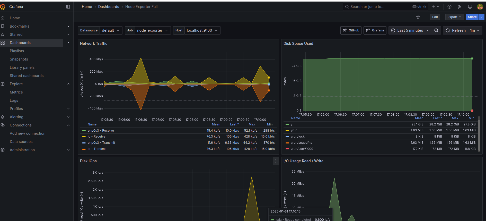

# Отчет по выполнение проекта DO4_LinuxMonitoring

Первые 5 пунктов не требуют пояснений в виде скриншотов.

## Part 6. **GoAccess**

> Все записи, отсортированные по коду ответа;

> Все уникальные IP, встречающиеся в записях;

> Все запросы с ошибками (код ответа — 4хх или 5хх);

## Part 7. **Prometheus** и **Grafana**

1. Добавил на дашборд **Grafana** отображение ЦПУ, доступной оперативной памяти, свободное место и кол-во операций ввода/вывода на жестком диске.

> кастомный дашборд

2. Запустил bash скрипт из 2 части и зафиксировал изменения на панелях.

> обновленный дашборд

3. Установил утилиту **stress** и запустил команду `stress -c 2 -i 1 -m 1 --vm-bytes 32M -t 10s`

> результат выполнения команды

> обновленный дашборд

## Part 8. Готовый дашборд

1. Установил готовый дашборд *Node Exporter Quickstart and Dashboard* с официального сайта **Grafana Labs**.

> импортированный дашборд

2. Запустил bash скрипт из 2 части и зафиксировал изменения на панелях.

> обновленный дашборд

> обновленный дашборд

3. Запустил команду `stress -c 2 -i 1 -m 1 --vm-bytes 32M -t 10s`

> результат выполнения команды

> обновленный дашборд

> обновленный дашборд

4. Запустил тест нагрузки сети с помощью утилиты **iperf3**.

> дашборд с пропускной способностью и исходящим трафиком

