# Отчет по выполнению проекта DO5_SimpleDocker

## Part 1. Готовый докер

1. ##### Взял официальный докер-образ с **nginx** и выкачал его при помощи `docker pull`.
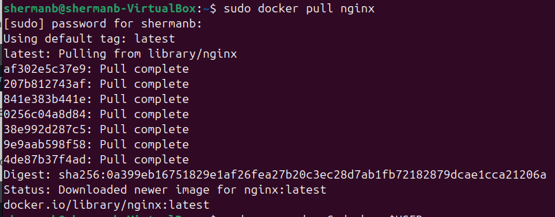
> docker pull nginx

2. ##### Проверил наличие докер-образа через `docker images`.
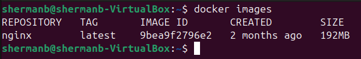
> docker images

3. ##### Запустил докер-образ через `docker run -d [image_id|repository]`.
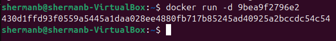
> docker run image

4. ##### Проверил, что образ запустился через `docker ps`.
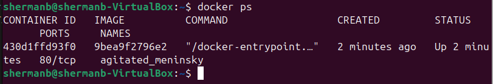
> starting image

5. ##### Посмотрел информацию о контейнере через `docker inspect [container_id|container_name]`.
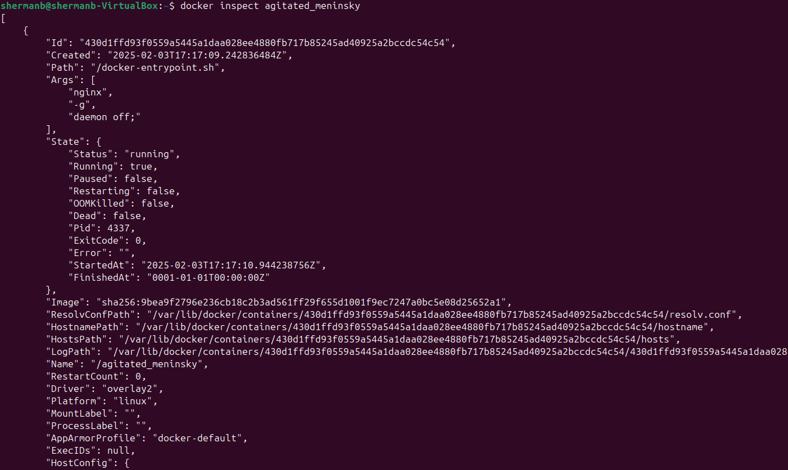
> inspect image

- ##### По выводу команды определил размер контейнера, список замапленных портов и ip контейнера.
- "IPAddress": "172.17.0.2"
- "80/tcp": null. Порт 80/tcp открыт, но не замаплен на хост.

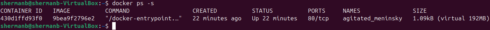
> docker size

6. ##### Остановил докер контейнер через `docker stop [container_id|container_name]`.
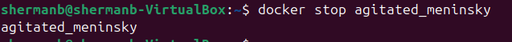
> docker stop

7. ##### Проверил, что контейнер остановился через `docker ps`.
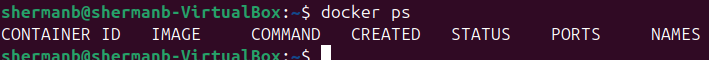
> no running docker

8. ##### Запустил докер с портами 80 и 443 в контейнере, замапленными на такие же порты на локальной машине, через команду *run*.
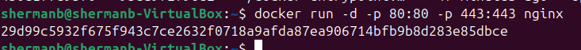
> docker run

9. ##### Проверил, что в браузере по адресу *localhost:80* доступна стартовая страница **nginx**.
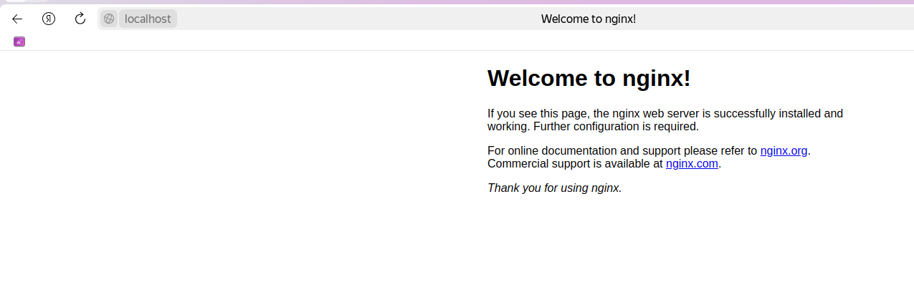
> localhost:80

10. ##### Перезапустил докер контейнер через `docker restart [container_id|container_name]`.
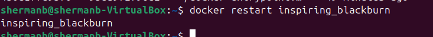
> docker restart

11. ##### Проверил любым способом, что контейнер запустился.
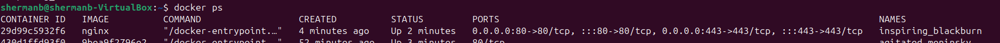
> docker ps

## Part 2. Операции с контейнером

1. ##### Прочитал конфигурационный файл *nginx.conf* внутри докер контейнера через команду *exec*.
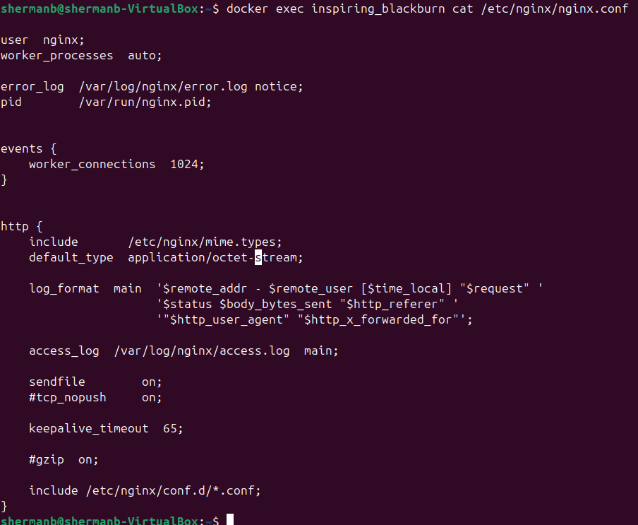
> nginx.conf

2. ##### Создал на локальной машине файл *nginx.conf*. Настроил в нем по пути */status* отдачу страницы статуса сервера **nginx**.
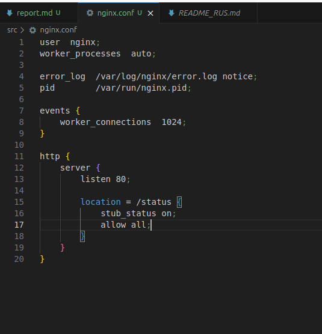
> local nginx.conf

3. ##### Скопировал созданный файл *nginx.conf* внутрь докер-образа через команду `docker cp`.
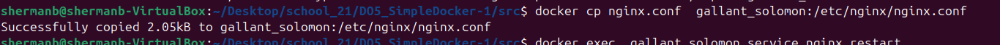
> docker cp nginx.conf

4. ##### Перезапустил **nginx** внутри докер-образа через команду *exec*.
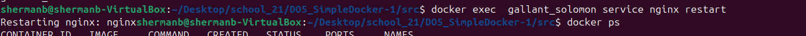
> docker exec nginx restart

5. ##### Проверил, что по адресу *localhost:80/status* отдается страничка со статусом сервера **nginx**.
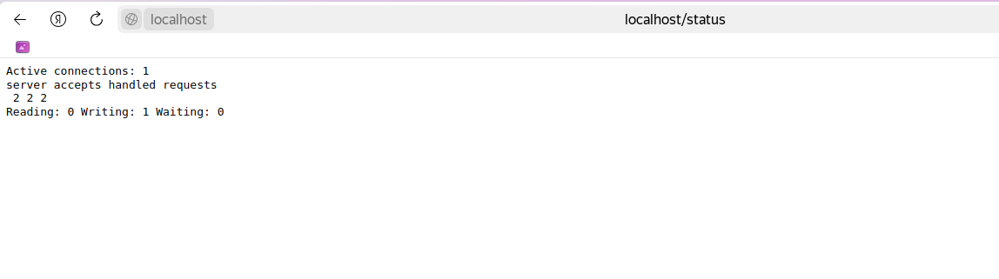
> localhost:80/status

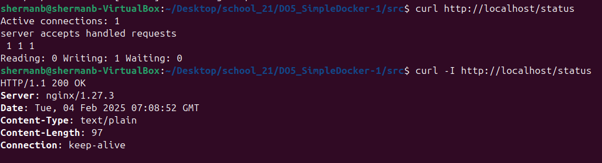
> curl localhost/status

6. ##### Экспортировал контейнер в файл *container.tar* через команду *export*.
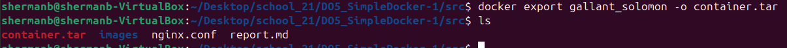
> docker export 

7. ##### Остановил контейнер.
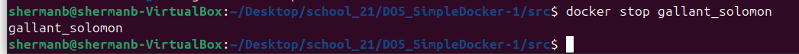
> docker stop

8. ##### Удалил образ через `docker rmi [image_id|repository]`, не удаляя перед этим контейнеры.
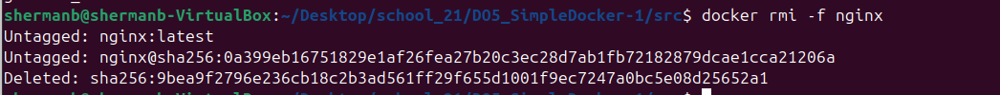
> docker rmi

9. ##### Удалил остановленный контейнер.
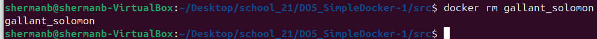
> docker rm 

10. ##### Импортировал контейнер обратно через команду *import*.
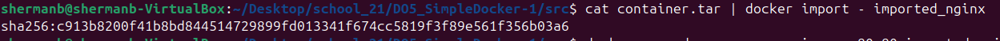
> docker import

11. ##### Запустил импортированный контейнер.
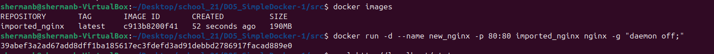
> docker run

12. ##### Проверил, что по адресу *localhost:80/status* отдается страничка со статусом сервера **nginx**.
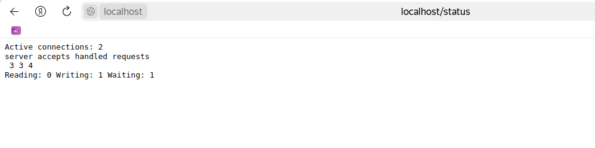
> localhost:80/status

## Part 3. Мини веб-сервер

1. ##### Написал мини-сервер на **C** и **FastCgi**, который будет возвращать простейшую страничку с надписью `Hello World!`.
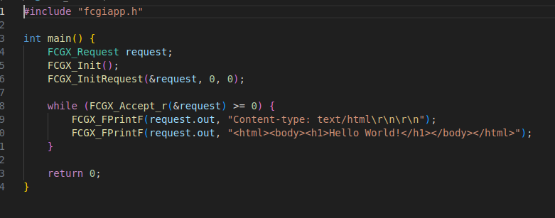
> web_server.c

2. ##### Запустил написанный мини-сервер через *spawn-fcgi* на порту 8080.
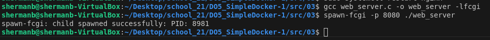
> start web_server

3. ##### Написал свой *nginx.conf*, который будет проксировать все запросы с 81 порта на *127.0.0.1:8080*.
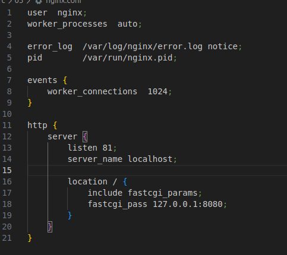
> nginx.conf

4. ##### Проверил, что в браузере по *localhost:81* отдается написанная страничка.
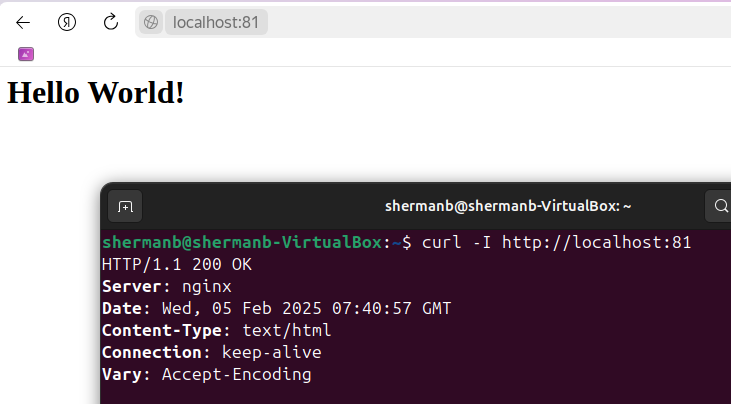
> localhost:81

5. ##### Положил файл *nginx.conf* по пути *./nginx/nginx.conf* 
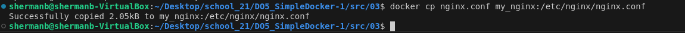
> docker cp nginx.conf

## Part 4. Свой докер

1. #### Написал свой докер-образ, который:
##### 1) собирает исходники мини сервера на FastCgi из [Части 3](#part-3-мини-веб-сервер);
##### 2) запускает его на 8080 порту;
##### 3) копирует внутрь образа написанный *./nginx/nginx.conf*;
##### 4) запускает **nginx**.

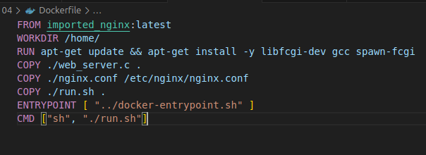
> Dockerfile

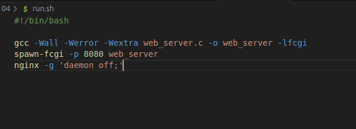
> run.sh

2. ##### Собрал написанный докер-образ через `docker build` при этом указав имя и тег.
##### Проверил через `docker images`, что все собралось корректно.
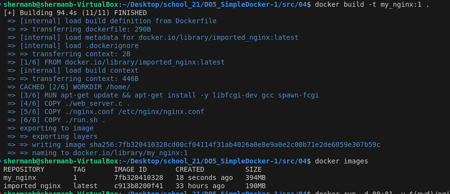
> docker build & images

3. ##### Запустил собранный докер-образ с маппингом 81 порта на 80 на локальной машине и маппингом папки *./nginx* внутрь контейнера по адресу, где лежат конфигурационные файлы **nginx**'а (см. [Часть 2](#part-2-операции-с-контейнером)).
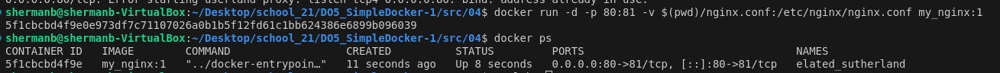
> docker run

4. ##### Проверил, что по localhost:80 доступна страничка написанного мини сервера.
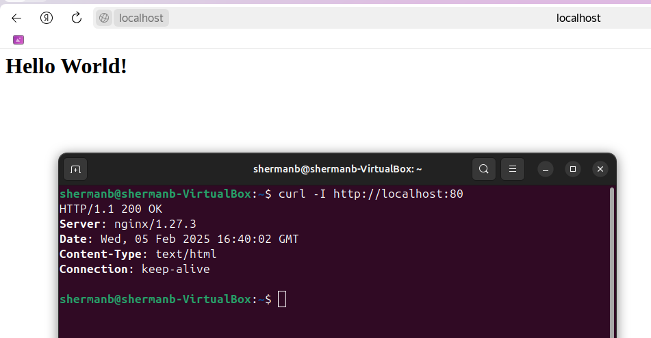
> localhost:80

5. ##### Дописал в *./nginx/nginx.conf* проксирование странички */status*, по которой надо отдавать статус сервера **nginx**.
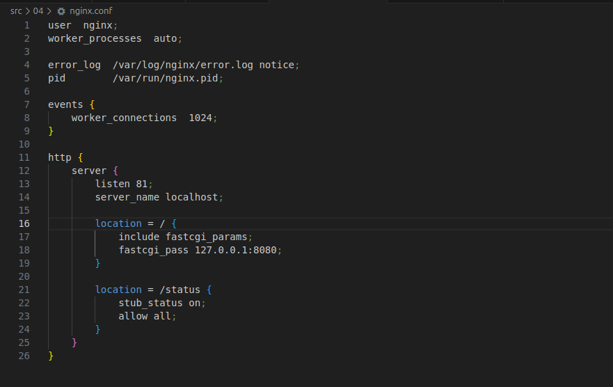
> localhost:80/status

6. ##### Перезапустил докер-образ.
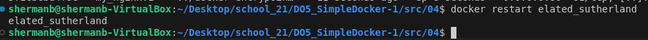
> docker restart

7. ##### Проверил, что теперь по *localhost:80/status* отдается страничка со статусом **nginx**
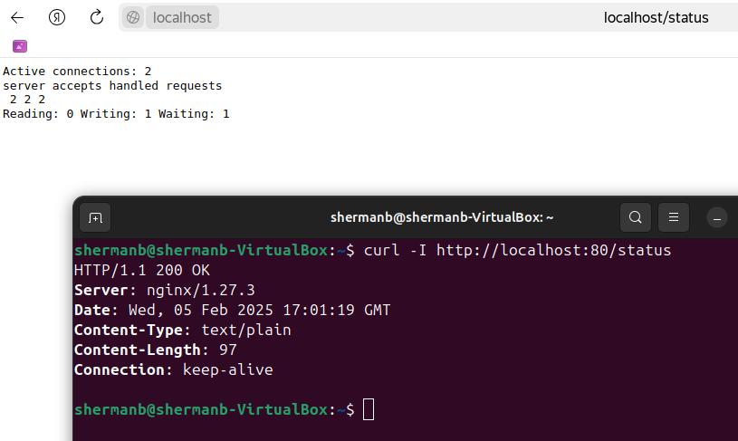
> localhost:80/status

## Part 5. **Dockle**

1. ##### Просканировал образ из предыдущего задания через `dockle [image_id|repository]`.
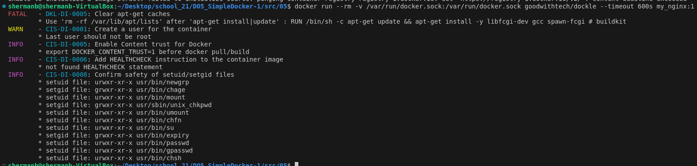
> dockle my_nginx:1

2. ##### Исправил образ так, чтобы при проверке через **dockle** не было ошибок и предупреждений.
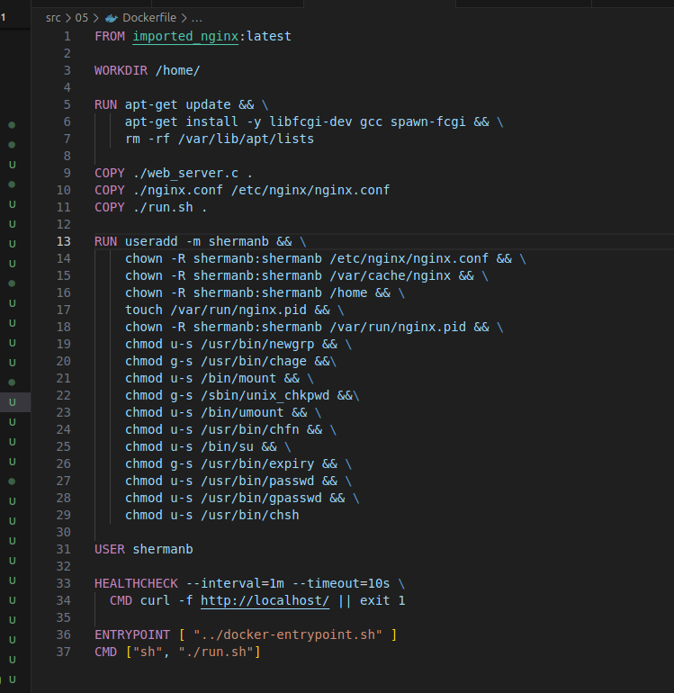
> changed Dockerfile

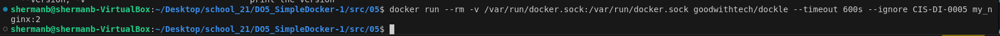
> dockle my_nginx:2 without errors

3. Запустил образ и проверил статус странички.

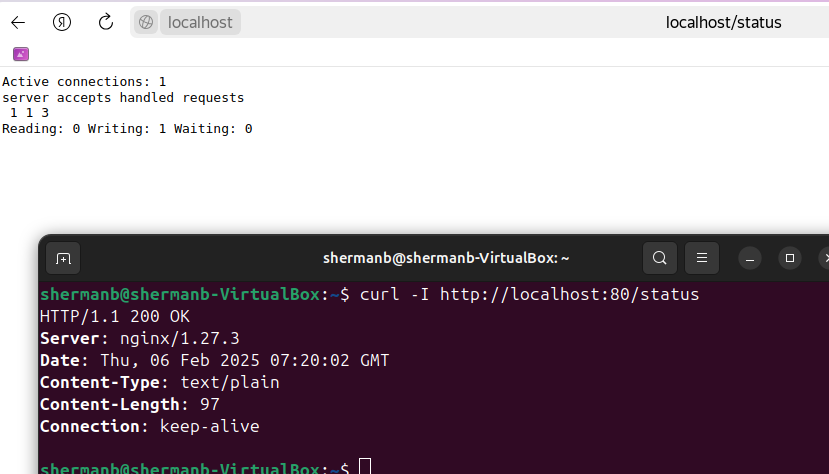
> localhost:80/status

## Part 6. Базовый **Docker Compose**

1. ##### Написал файл *docker-compose.yml*, с помощью которого:
##### 1) Поднимаю докер-контейнер из [Части 5](#part-5-инструмент-dockle) _(он должен работать в локальной сети, т. е. не нужно использовать инструкцию **EXPOSE** и мапить порты на локальную машину)_.
##### 2) Поднимаю докер-контейнер с **nginx**, который будет проксировать все запросы с 8080 порта на 81 порт первого контейнера.

##### Замапил 8080 порт второго контейнера на 80 порт локальной машины.
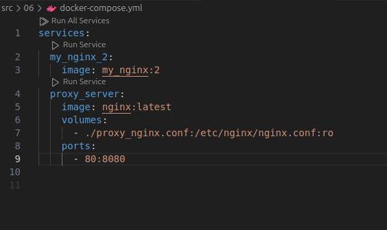
> docker-compose.yml

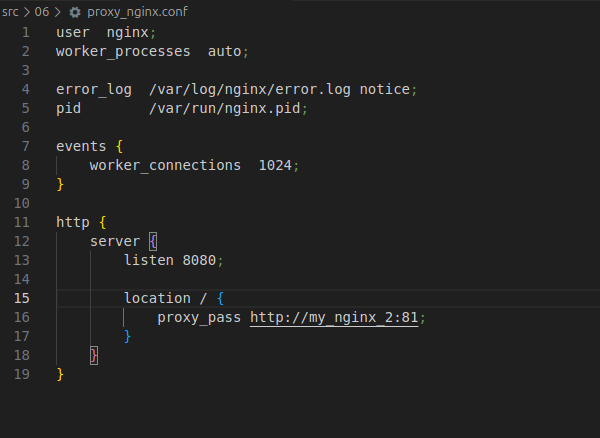
> proxy_nginx.conf

2. ##### Остановил все запущенные контейнеры. Собрал и запустил проект с помощью команд `docker-compose build` и `docker-compose up`.
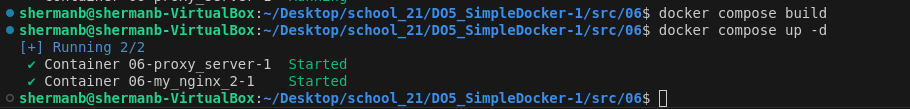
> doсker compose build & up

3. ##### Проверил, что в браузере по *localhost:80* отдается написанная тобой страничка, как и ранее.
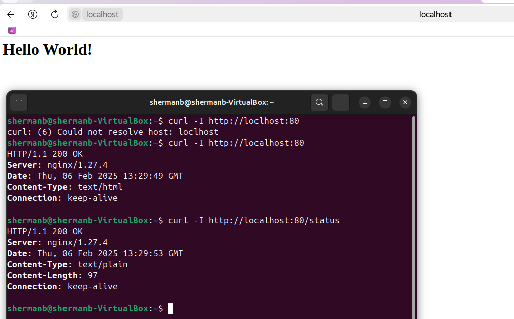
> localhost:80
