# Отчет по выполнению проекта DO6_CICD

### Part 1. Настройка **gitlab-runner**

1. ##### Скачал и установил на виртуальную машину **gitlab-runner**.

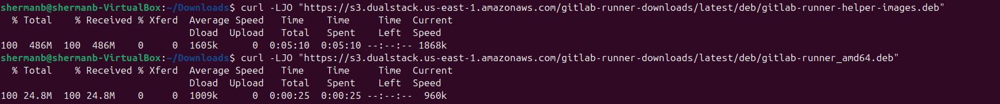
> Скачал файлы gitlab-runner_amd64.deb и gitlab-runner-helper-images.deb

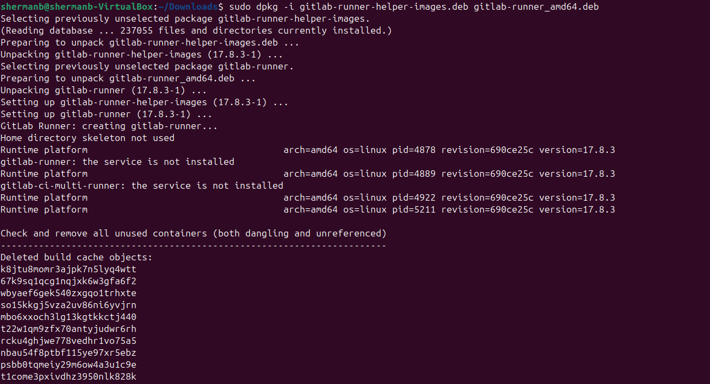
> Установил файлы gitlab-runner_amd64.deb и gitlab-runner-helper-images.deb

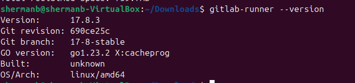
> Успешная установка

2. ##### Запустил **gitlab-runner** и зарегистрировал его для использования в текущем проекте (*DO6_CICD*).

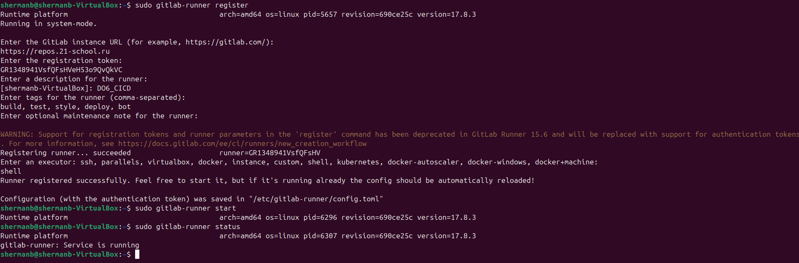
> Запуск и регистрация 

### Part 2. Сборка

1. ##### Написал этап для **CI** по сборке приложений из проекта *C2_SimpleBashUtils*.
В файле _gitlab-ci.yml_ добавил этап запуска сборки через мейк файл из проекта _C2_.

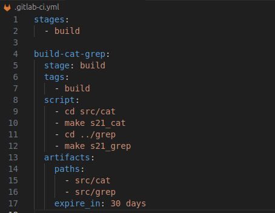
> build

2. ##### Запушил файлы и проверил pipelines на gitlab.

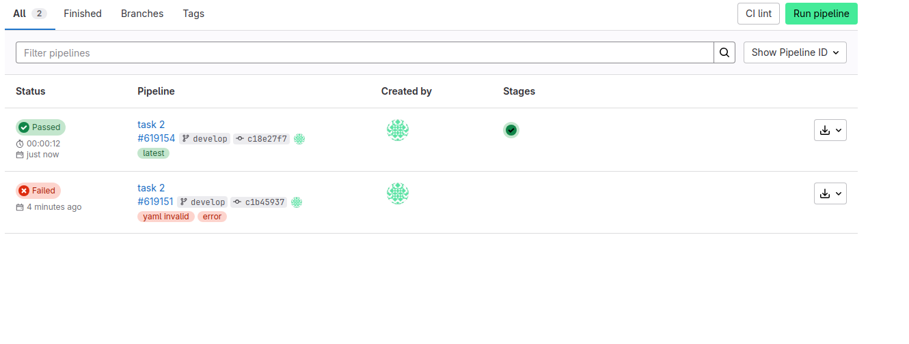
> Успешный pipeline

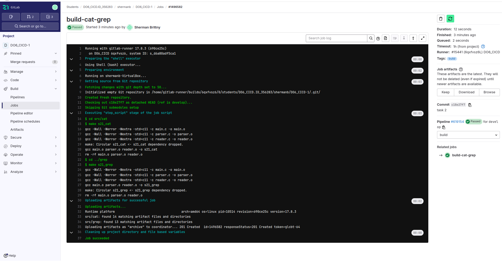
> Вывод в jobs в результате сборки

3. ##### Файлы, полученные после сборки (артефакты), сохрани в произвольную директорию со сроком хранения 30 дней.

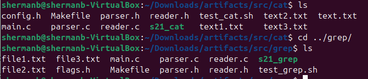
> Артефакты

### Part 3. Тест кодстайла

1. ##### Написал этап для **CI**, который запускает скрипт кодстайла (*clang-format*).

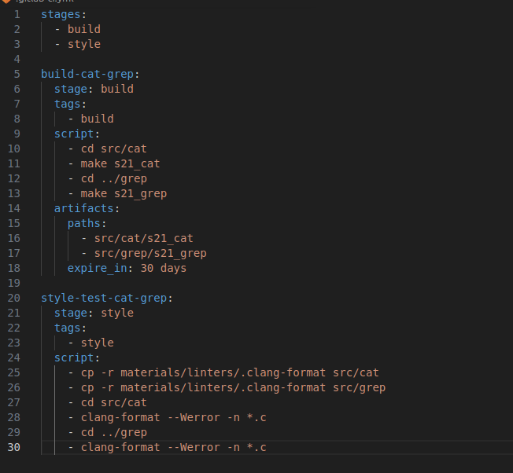
> clang test

2. ##### Запушил файлы и проверил pipelines на gitlab.

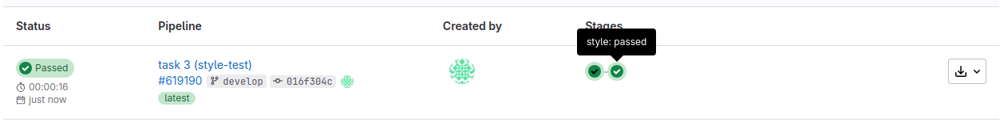
> Успешный pipeline

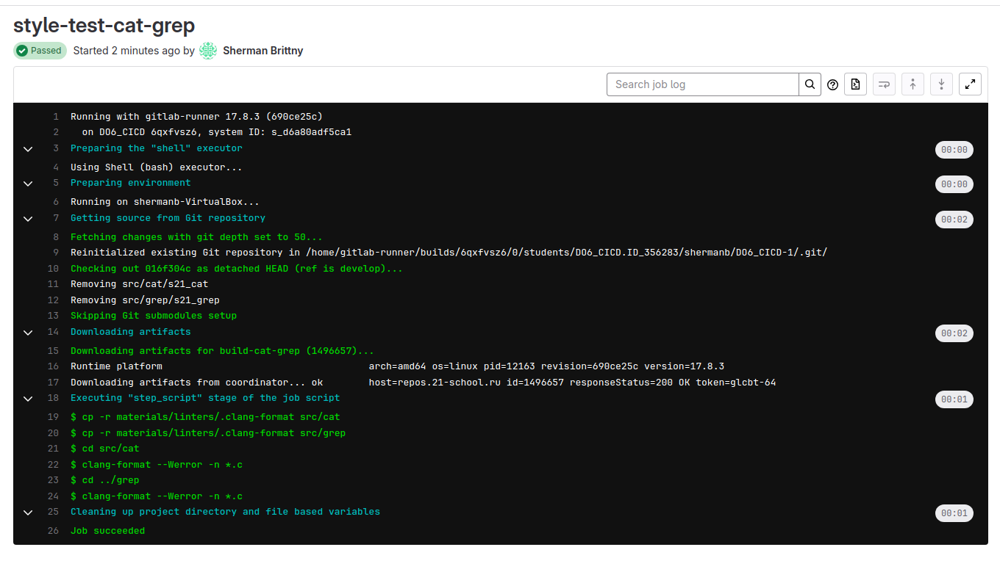
> Вывод в jobs в результате сборки

### Part 4. Интеграционные тесты

1. #### Написал этап для **CI**, который запустит интеграционные тесты.

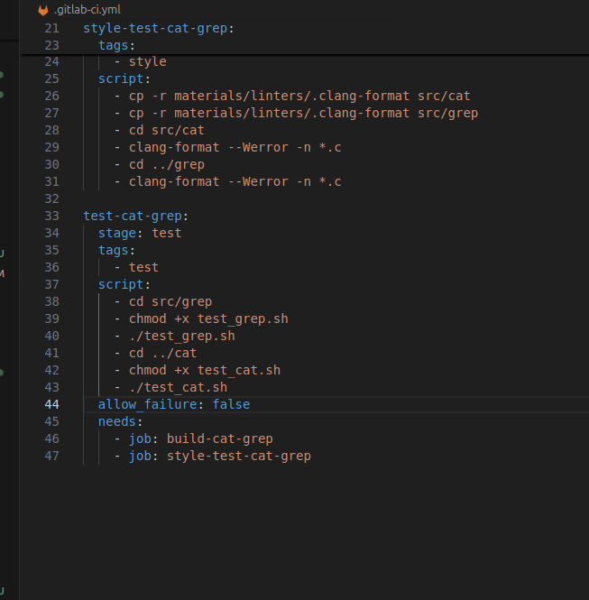
> tests

2. ##### Запушил файлы и проверил pipelines на gitlab. 

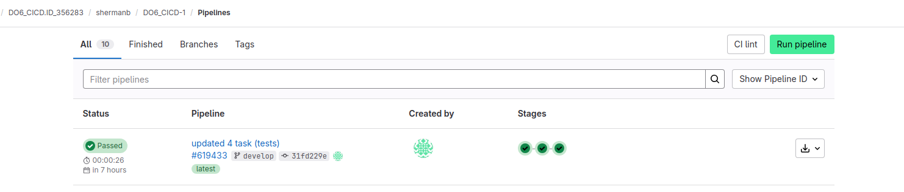
> Успешный pipeline

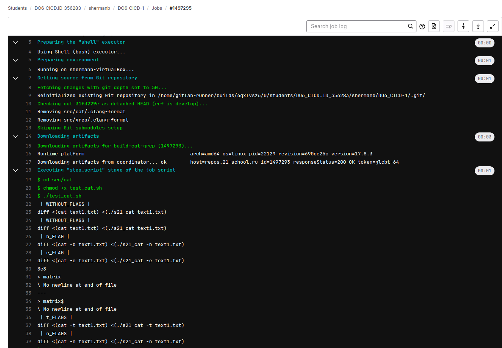
> Вывод в jobs в результате тестов cat

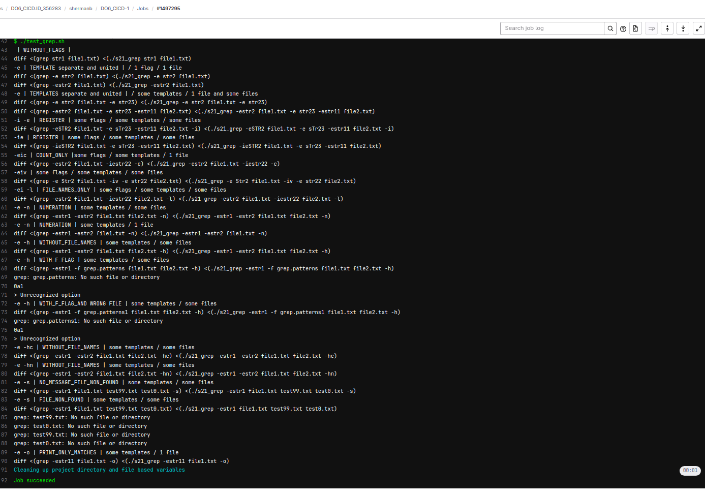
> Вывод в jobs в результате тестов grep

### Part 5. Этап деплоя

1. #### Написал этап для **CD**, который «разворачивает» проект на другой виртуальной машине.

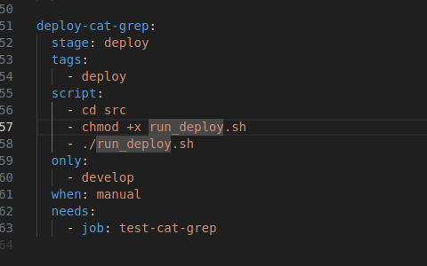
> Этап деплоя

2. ##### Написал bash-скрипт, который при помощи **ssh** и **scp** копирует файлы, полученные после сборки (артефакты), в директорию */usr/local/bin* второй виртуальной машины.

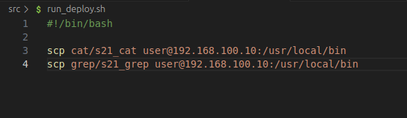
> run_deploy.sh

3. #### Выполнил настройку сервиса ssh на двух машинах. Добавил SSH-ключи для GitLab Runner на локальной маишне. Скопировал публичный ключ на удаленную машину.

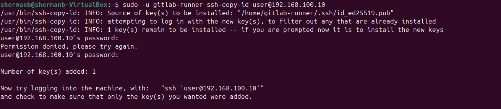
> ssh-copy-id 

4. #### Зашел на удаленный сервер. Если заходит без пароля - все настроено правильно.

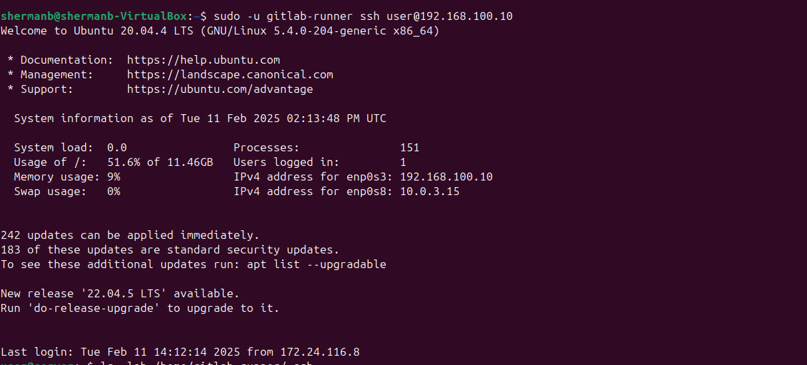
> ssh

5. #### Запустил этот этап вручную при условии, что все предыдущие этапы прошли успешно.

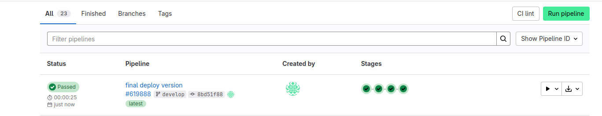
> Успешный pipeline

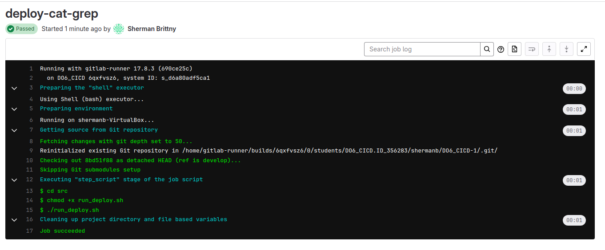
> Вывод в job

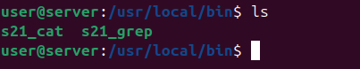
> Файлы на удаленном сервере в usr/local/bin

6. ##### Сохранил дампы образов виртуальных машин.

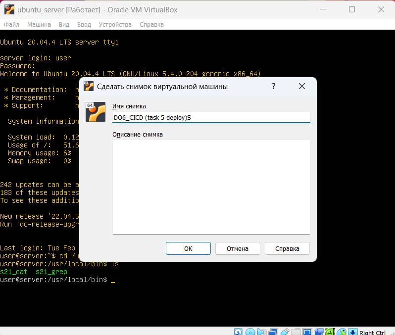
> Дампы машин