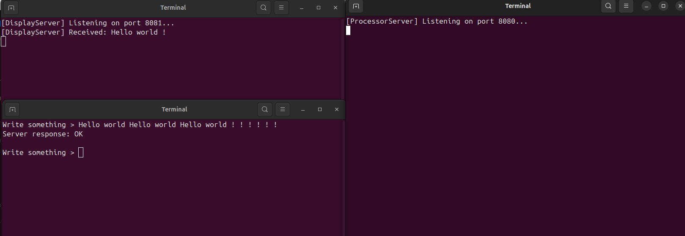

## Консольное прилоложение на языке С++ для обработки предложений

### Взаимодействие

Пользователь вводит данные в консольное приложение.
Данные отправляются на сервер обработки данных.
Сервер обработки данных парсит данные, преобразует их и отправляет модифицированные данные на сервер отображения результата.
Сервер отображения результата выводит полученные данные на экран.

## Описание работы

### Консольное приложение

После запуска, консольное приложение подключается к серверу обработки данных. Параметры подключения задаются через командную строку.
Если сервер не доступен или произошла ошибка подключения, то выводится ошибка на экран и прекращается ожидание ввода данных.
Приложение в цикле принимает данные, которые вводит пользователь.
По нажатию на кнопку Enter приложение отправляет данные на сервер обработки данных и снова переходит к ожиданию ввода данных пользователя.

### Сервер обработки данных

После запуска, сервер обработки данных начинает ожидать подключения клиента.
Сервер обработки данных подключается к серверу отображения результата. Получив данные от клиентского приложения, сервер проверяет их корректность. После получения данных сервер отправляет клиентскому приложению подтверждение, что получил данные полностью.
Далее сервер преобразует полученные данные в строку слов, разделенных пробелами. Сервер находит и удаляет дубликаты слов в этой строке.
Получившийся результат сервер передает дальше на сервер отображения результата.

### Сервер отображения результата

После запуска, сервер отображения результата ожидает подключения от сервера обработки данных. Сервер отображения результата получает от сервера обработки данных информацию, которую выводит на экран.

> running app