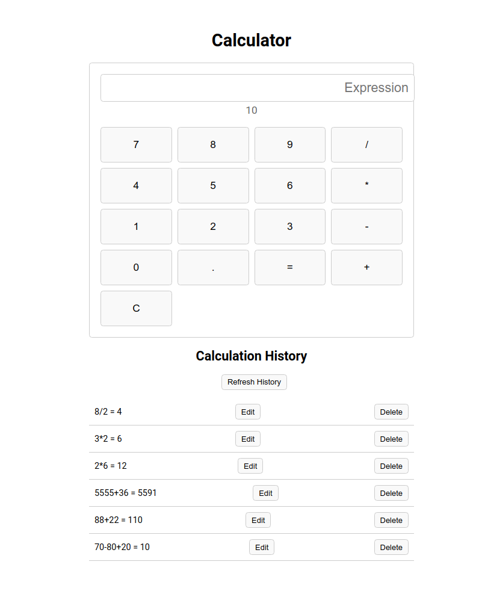

# GO_BACKEND_PROJECT: REST API для веб-калькулятора

Простое REST API для веб-приложения калькулятора с историей вычислений.
Проект реализован на Golang с использованием PostgreSQL для хранения данных и Docker для удобного развертывания.

##  Функционал
- **4 основных HTTP-метода**:
  - `POST /calculations` — выполнение математических операций.
  - `GET /calculations` — получение истории вычислений.
  - `PATCH /calculations/:id` — редактирование записи в истории.
  - `DELETE /calculations/:id` — удаление записи.
- Поддержка операций: `+`, `-`, `*`, `/`.
- Сохранение результатов в **PostgreSQL** через ORM.
- Чистая архитектура с разделением на слои:
  - **Handlers** (HTTP-роутинг).
  - **Service** (бизнес-логика).
  - **Repository** (работа с БД).

## Внешний вид проекта

> Фронтенд подключается к моему API для вычислений и сохранения истории.

> Статусы запросов и их результаты.
